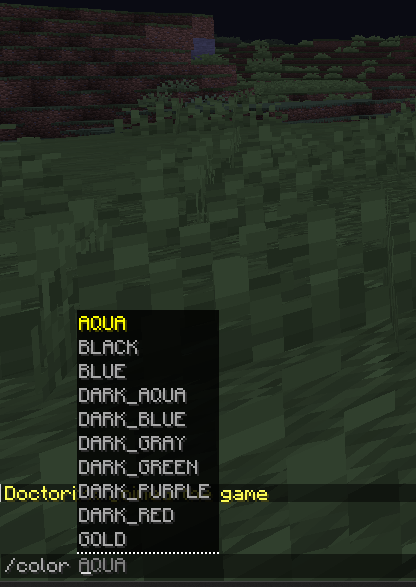
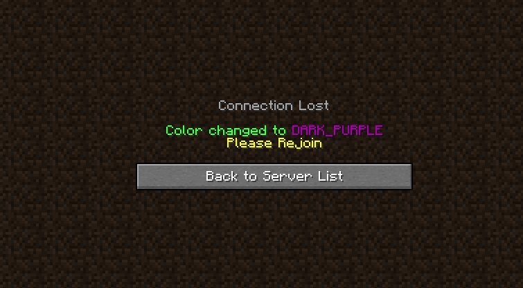

# ColoredNicks

[DOWNLOAD PLUGIN](#)

[[Ru]](https://github.com/Windows-up/ColoredNicksPlugin#ru)
[[EN]](https://github.com/Windows-up/ColoredNicksPlugin#en)

___

## [EN]
Plugin for minecraft for change nickname color

#### Native version: 1.16.5
#### Tested versions: 1.16.5 - 1.19.4

## [DOWNLOAD PLUGIN](https://github.com/Windows-up/ColoredNicksPlugin/releases/tag/1.0)

### Commands
#### /color

(For display prefixes in chat I used [ChatEx](https://spigotmc.org/resources/chatex-continued.71041/) plugin ) 

#### Dependencies
* [Vault](https://https://www.spigotmc.org/resources/vault.34315/)
* [LuckPerms](https://luckperms.net/download)

___

## [RU]
Плагин для майнкрафт, благодаря которому игроки смогут сменить себе цвет ника

#### Нативная версия: 1.16.5
#### Проверенные версии: 1.16.5 - 1.19.4

## [СКАЧАТЬ ПЛАГИН](https://github.com/Windows-up/ColoredNicksPlugin/releases/tag/1.0)

### Команды
#### /color

(Для отображения префиксов использовался плагин [ChatEx](https://spigotmc.org/resources/chatex-continued.71041/))

#### Зависимости
* [Vault](https://https://www.spigotmc.org/resources/vault.34315/)
* [LuckPerms](https://luckperms.net/download)

